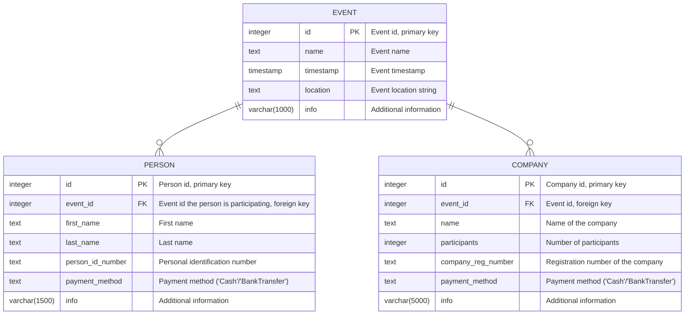

# EventBooker

## Postgres andmebaasi diagramm



## Setup

Lokaalseks testimiseks peab kõigepealt seadistama postgres andmebaasi. Selletarvis on olemas `docker-compose` setup, mille saab `EventBooking/` kaustast käivitada selliselt:

```bash
$ docker-compose up -d
```

Esmakordsel käivitamisel tuleb ka andmebaasi migratsioonid ära teha:

```bash
$ dotnet ef database update
```

Seejärel saab käivitada serveri:

```bash
dotnet watch
```
