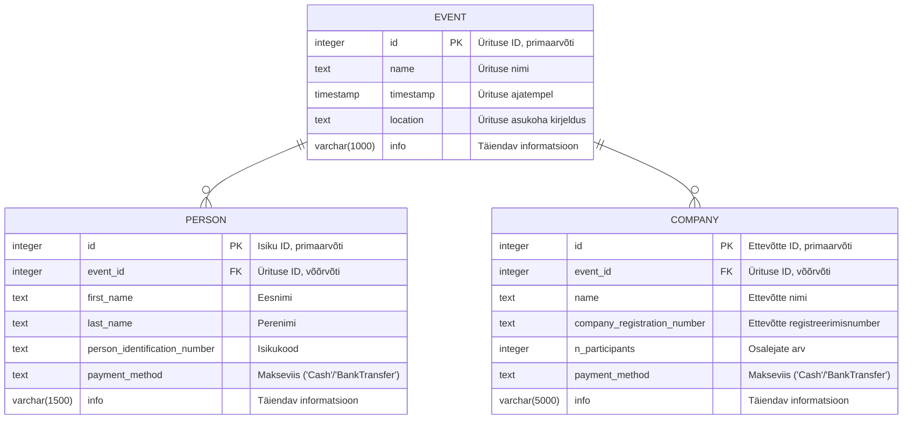

# EventBooking

## Seadistus

Lokaalseks testimiseks peab seadistama postgres andmebaasi. Selletarvis on olemas `docker-compose` setup, mille saab `EventBooking/` kaustast käivitada selliselt:

```bash
$ docker-compose up -d
```

Et õiged konfiguratsioonifailid üles leida, peab keskkonnamuutujatele õiged väärtused omistama (täpne käsk sõltub operatsioonisüsteemist):
```
ASPNETCORE_ENVIRONMENT=Development
```

Esmakordsel käivitamisel tuleb ka installida `EF Core` andmebaasi töövahendid:

```bash
dotnet tool install --global dotnet-ef
```

Siis saab käivitatud andmebaasil migratsioonid ära teha:

```bash
$ dotnet ef database update
```

Seejärel saab käivitada serveri:

```bash
$ dotnet watch
```

Sõltuvalt keskkonnast võib tekkida veateateid SSL sertifikaatidega, ent neid peaks olema võimalik ignoreerida.

## Projekti ülesehitus

Projekti jaoks olulisemad kaustad/failid:

* Data/Adapters/DBAdapter.cs - Kõik andmebaasi puudutavad operatsioonid on siia faili koondatud

* Models/ - Iga andmebaasi tabeli jaoks mudel koos tingimustega (vt. andmebaasi diagrammi)
    * Models/EventModel.cs - Ürituse tabeli definitsioon
    * Models/PersonModel.cs - Eraisiku tabeli definitsioon
    * Models/CompanyModel.cs - Ettevõtte tabeli definitsioon

* Pages/ - Lehekülgede definitsioonid
    * Pages/Shared/_Layout.cshtml - Lehekülje üldstruktuur, header/footer
    * Pages/Index.* - Avaleht koos toimunud ja tulevaste üritustega
    * Pages/CreateEvent.* - Ürituse lisamine
    * Pages/ShowEvent.* - Osalejate vaatamine/lisamine (tegelikult peaksid vaatamine ja lisamine olema juhendi järgi eraldi leheküljed)

* wwwroot/
    * wwwroot/css - Veebilehe CSS
    * wwwroot/js - Veebilehe abistav Javascript

### Postgres andmebaasi diagramm



### Tehnoloogiad

* .NET 8.0.0
* Razor
* EF Core
* Postgres

## Skoop

Tegin ära enamiku ülesandest, aga jätsin praegu välja konkreetse osaleja andmete vaatamise/muutmise vaate, ja nupu, mille abil saab osaleja kustutada. Osalejat on siiski võimalik näha ürituse vaatest, kuigi mitte kõiki detailandmeid. Mõnes kohas ei kontrolli ma praegu ka piisaval määral sisestatud andmete õigsust. Neis mingit sellist keerukust/tehnoloogiat ei tohiks olla, mida juba olemasolevas koodis näha poleks.

Püüdsin veebilehe välimuse juures matkida kaasapandud kuvatõmmiseid.

### Testimine

Teste praegu ei lisanud, sest minu backend kogemus on seni olnud enamjaolt Pythoni baasil (natuke ka Typescript Node.js) ja polnud varem tuttav .NET-is kasutatavate töövahenditega, ning projekt oli niigi mahukas. Samas toon välja ligikaudse plaani, kuidas läheneksin testimisele.

Põhjalikuma testimise jaoks jooksutaksin teste päris andmebaasi vastu. `docker-compose.yml` faili saab lisada teise identse, kuid sõltumatute andmetega andmebaasi, millel oleks teine port. Seda saaks kasutada testide jooksutamisel. Testiksin järgnevaid osi:

* `Data/Adapters/DbAdapter.cs` sisaldab andmebaasi operatsioone, ja nende tarvis peaks kindlasti integratsioonitestid tegema
* UI testide puhul on samuti võimalik tekitada andmebaasi kandeid (või mockida `DbAdapter`-it). Seejärel saab testida, kas vastavad kanded kuvatakse kasutajale (nt. kas näiteks kirjes sisalduv osaleja nimi päriselt ka kuvatakse). Samuti on võimalik kontrollida, kas nupuvajutuse peale ürituse lisamine või kustutamine viib `DbAdapter`-i väljakutsumiseni.
