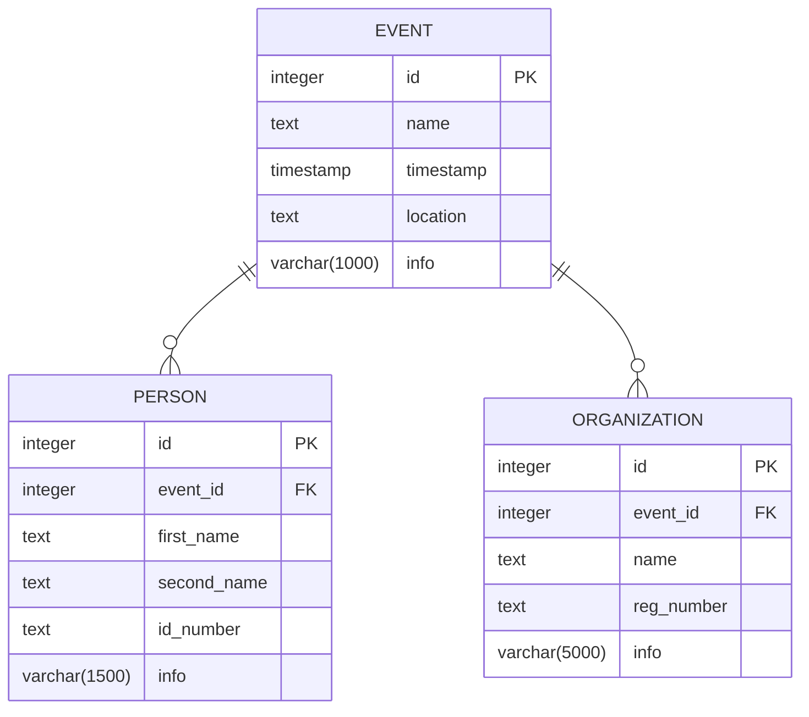

# EventBooker

## PostgreSQL Database Diagram

```mermaid
erDiagram

    EVENT {
        integer id PK
        text name
        timestamp timestamp
        text location
        varchar(1000) info
    }
    PERSON {
        integer id PK
        integer event_id FK
        text first_name
        text second_name
        text id_number
        varchar(1500) info
    }
    ORGANIZATION {
        integer id PK
        integer event_id FK
        text name
        text reg_number
        varchar(5000) info
    }
    EVENT ||--o{ PERSON : ""
    EVENT ||--o{ ORGANIZATION : ""
```