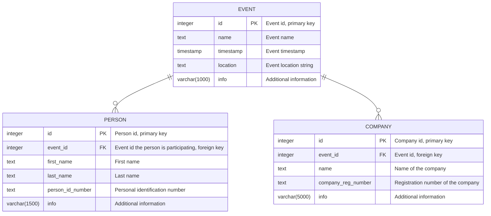

# EventBooker

## PostgreSQL Database Diagram

```mermaid
erDiagram

    EVENT {
        integer id PK "Event id, primary key"
        text name "Event name"
        timestamp timestamp "Event timestamp"
        text location "Event location string"
        varchar(1000) info "Additional information"
    }
    PERSON {
        integer id PK "Person id, primary key"
        integer event_id FK "Event id the person is participating, foreign key"
        text first_name "First name"
        text last_name "Last name"
        text person_id_number "Personal identification number"
        varchar(1500) info "Additional information"
    }
    COMPANY {
        integer id PK "Company id, primary key"
        integer event_id FK "Event id, foreign key"
        text name "Name of the company"
        text company_reg_number "Registration number of the company"
        varchar(5000) info "Additional information"
    }
    EVENT ||--o{ PERSON : ""
    EVENT ||--o{ COMPANY : ""
```