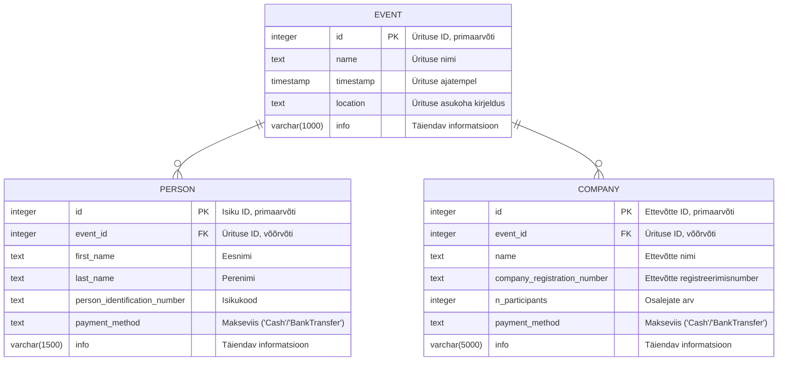

# EventBooker

## Postgres andmebaasi diagramm



## Seadistus

Lokaalseks testimiseks peab seadistama postgres andmebaasi. Selletarvis on olemas `docker-compose` setup, mille saab `EventBooking/` kaustast käivitada selliselt:

```bash
$ docker-compose up -d
```

Et õiged konfiguratsioonifailid üles leida, peab keskkonnamuutujatele õiged väärtused omistama:
```
ASPNETCORE_ENVIRONMENT=Development
```

Esmakordsel käivitamisel tuleb ka andmebaasi migratsioonid ära teha:

```bash
$ dotnet ef database update
```

Seejärel saab käivitada serveri:

```bash
$ dotnet watch
```

## Projekti ülesehitus

Projekti jaoks olulisemad kaustad/failid:

* Data/Adapters/DBAdapter.cs - Kõik andmebaasi puudutavad operatsioonid on siia faili koondatud

* Models/ - Iga andmebaasi tabeli jaoks mudel koos constraintidega.
    * Models/EventModel.cs - Ürituse tabeli definitsioon
    * Models/PersonModel.cs - Eraisiku tabeli definitsioon
    * Models/CompanyModel.cs - Ettevõtte tabeli definitsioon

* Pages/ - Lehekülgede definitsioonid
    * Pages/Shared/_Layout.cshtml - Lehekülje üldstruktuur, header/footer
    * Pages/Index.* - Avaleht koos toimunud ja tulevaste üritustega
    * Pages/CreateEvent.* - Ürituse lisamine
    * Pages/ShowEvent.* - Osalejate vaatamine/lisamine (tegelikult peaksid vaatamine ja lisamine olema juhendi järgi eraldi leheküljed)

* wwwroot/
    * wwwroot/css - Veebilehe CSS
    * wwwroot/js - Veebilehe abistav Javascript

## Skoop

Tegin ära enamiku ülesandest, aga jätsin praegu välja konkreetse osaleja andmete vaatamise/muutmise/kustutamise. Iseenesest neis mingit sellist keerukust/tehnoloogiaid ei tohiks olla, mida juba olemasolevas koodis näha poleks.

Püüdsin veebilehe välimuse juures matkida kaasapandud kuvatõmmiseid.

### Tehnoloogiad:

* .NET 8.0.0
* Razor
* EF Core
* Postgres
